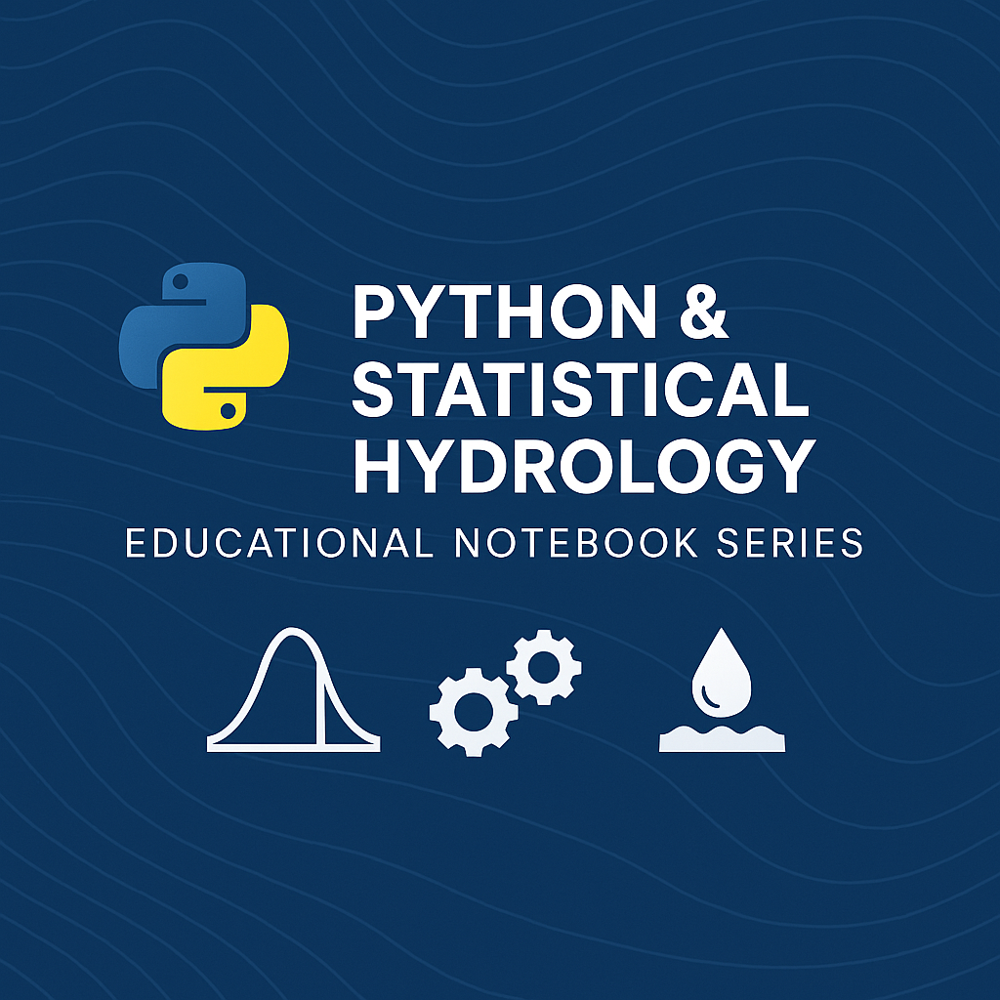

# 📚 Educational Notebook Series: Statistical & Machine Learning Methods in Hydrology

  

This repository provides a structured set of Jupyter Notebooks designed to teach **Python programming**, **statistics**, and **machine learning** within the context of **hydrology** and **environmental science**.

---

## 📘 Notebook Modules

| Notebook No. | Title | Key Topics |
|--------------|-------|------------|
| 1️⃣ | Probability Distributions in Hydrology | Normal, Log-normal, Gamma fitting, rainfall extremes |
| 2️⃣ | Monte Carlo Simulation for Hydrological Uncertainty | Random sampling, uncertainty propagation |
| 3️⃣ | Time Series Analysis in Hydrology | ARIMA, decomposition, trend analysis |
| 4️⃣ | Extreme Value Analysis and Risk | GEV, return periods, flood risk |
| 5️⃣ | Spatial Hydrology and Interpolation | IDW, semivariograms, spatial maps |
| 6️⃣ | Machine Learning in Hydrology | Linear models, Random Forest, runoff prediction |

---

## 🧠 Learning Objectives

- Build foundational **Python skills** for data analysis
- Understand key **statistical concepts** used in hydrology
- Develop **ML pipelines** for hydrological prediction
- Apply methods to real or simulated **hydrological datasets**

---

## 🧑‍🔬 Contributors

- **Zuhail Abdullah** – Resource Person (Jr.)  
- **Dr. Harsh Upadhyay** – Scientist-B  

📍 **Affiliation**: National Institute of Hydrology, Roorkee, India

---

## 🤝 How to Contribute

We welcome your contributions to this open-source project!

1. Fork the repository on GitHub
2. Clone your fork and create a new branch
3. Add improvements, fixes, or examples
4. Push and create a Pull Request (PR)

---

## 📂 License

This repository is made available for **educational purposes only** under a permissive open license. Attribution is appreciated.

---

## 🔗 Suggested Tools & Libraries

- Python 3.x, NumPy, Pandas, Matplotlib
- SciPy, Statsmodels, Scikit-learn
- GeoPandas, Pykrige, Seaborn

---

Happy Hydrological Learning! 💧
